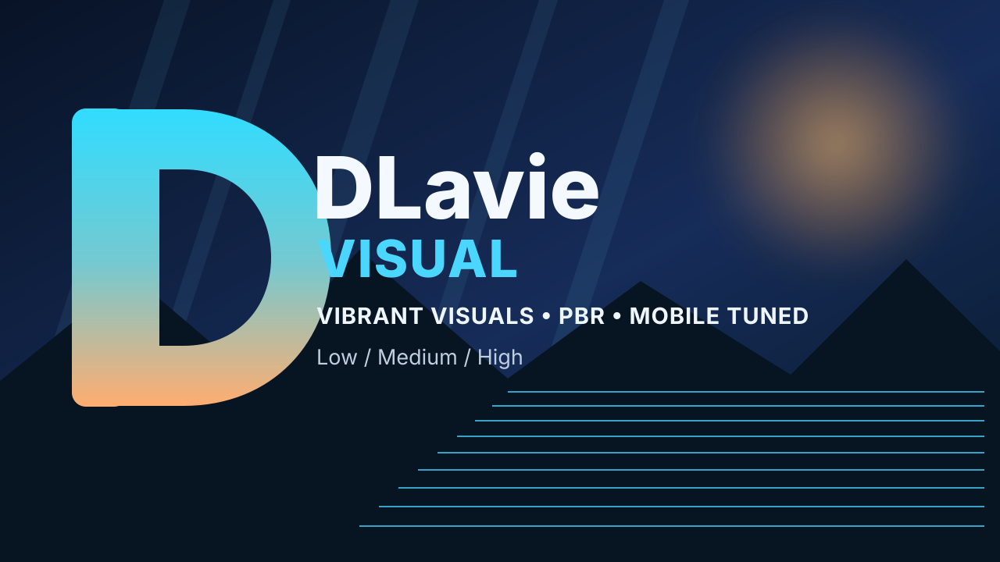

# DLavie Visual



**DLavie Visual** is a Minecraft Bedrock **Vibrant Visuals + PBR** resource pack
for the 26.x renderer line, with **Bedrock 26.45** as the primary target and
**1.26.40** as the manifest compatibility floor. It is built for supported
iPhone/iPad and Android hardware, with **iPhone 11 (A13)** as the minimum iPhone
performance target.

## What is ported

The uploaded Derivative 25.1.0 Java shader was audited and its visual priorities
were mapped to Bedrock-supported equivalents:

| Derivative feature | DLavie Visual / Bedrock equivalent |
|---|---|
| Atmospheric LUT / sky scattering | Vibrant Visuals atmosphere keyframes, Rayleigh/Mie tuning |
| Volumetric fog / light shafts | Bedrock volumetric fog density + media coefficients |
| Derivative cirrus profile | planar cirrus density texture + atmosphere scattering; the Derivative profile disables volumetric clouds |
| Direct sun/moon lighting | keyframed directional lighting |
| Rough reflections / SSR intent | Vibrant Visuals PBR roughness/metalness + engine reflections; water reflections remain engine-managed |
| Physics ocean / caustics | source-aligned wave speed/height + multi-octave Bedrock waves + original Derivative 60-frame caustics atlas when supplied at build time |
| Color grading / white balance | Vibrant Visuals grading, saturation, contrast, ~7000K white balance |
| Bloom/exposure intent | HDR/tone-mapping-friendly grading; final bloom/exposure stays renderer controlled |
| PBR materials | global MERS fallback so vanilla/third-party non-PBR textures still react plausibly to deferred lighting |

A literal GLSL 1:1 port is not technically possible on retail Bedrock because
Iris/OptiFine compute/fragment shader entry points are not exposed by RenderDragon.
This repository therefore targets **visual equivalence**, not byte/code equivalence.

## Pass 2 visual reconstruction

This pass follows the actual `Profile.Derivative` anchors instead of generic shader assumptions: 7000 K white balance, saturation 1.0, volumetric fog/light intent, planar cirrus mode, source-aligned water wave speed/height 1.0, warm ~3000 K local lights, and a clear-day physical sun scale. Medium/High also use a 60-frame 128px Bedrock caustics atlas. Nether and End now receive dedicated atmosphere, fog, grading and lighting instead of inheriting Overworld values.

### 2.3 cinematic rebuild

The 2.3 pass is calibrated toward the supplied Derivative gallery targets: stronger low-sun Mie scattering and light shafts, deep indoor contrast, calmer reflective water, original Derivative caustics when the supplied source asset is present, clearer turquoise underwater absorption, denser humid-biome fog, darker nights with warmer local lights, and custom rain/cirrus environment textures. It also uses separate clear-ocean, river, swamp and frozen-water profiles rather than one universal water definition.

## Presets

| Preset | Intended device | Main cost controls |
|---|---|---|
| **Low** | iPhone 11 while recording / supported lower-end Android | blocky shadows, 6 water octaves, restrained fog, caustics off |
| **Medium** | **iPhone 11 recommended** | soft shadows, 10 water octaves + 60-frame caustics, cinematic fog/rays |
| **High** | newer iPhone/iPad / stronger Android | soft 8-texel shadows, 14 water octaves, strongest Mie/fog contrast, stronger caustics |

All three subpacks use a permissive retail `memory_tier` gate so supported mobile devices can select Low, Medium, or High manually. Performance differences are controlled by the actual shadow, water, fog, and caustics costs rather than by locking the menu.

## PBR + other texture packs

DLavie Visual does not redistribute Mojang's vanilla block textures. Instead it
provides PBR fallback material values. A compatible PBR texture pack lower in the
resource stack can still supply its own texture sets; where no texture set exists,
DLavie's fallback roughness is used.

## Installation

1. Build or download `DLavie-Visual.mcpack`.
2. Open it with Minecraft.
3. Enable **DLavie Visual** in Global Resources or the world resource packs.
4. Open the pack's gear icon and select Low, Medium, or High.
5. In **Settings → Video**, select **Vibrant Visuals** when the device supports it.

### iPhone 11 baseline

Start with **Medium**, render distance around **8–12 chunks**, and the game's
performance-biased Vibrant Visuals quality option. If the phone thermally throttles
or you are screen-recording, use **Low**. High is intentionally not the iPhone 11
baseline.

## Build

Requirements: Python 3 + Pillow.

```bash
python3 -m pip install Pillow
./tools/build.sh
```

The output is `dist/DLavie-Visual.mcpack`.

Validation only:

```bash
python3 tools/generate_configs.py
python3 tools/generate_assets.py
python3 tools/validate_pack.py
```

## Source / license compliance

The supplied Derivative source is licensed under **DERCODE License Agreement 2.5**.
The license is preserved verbatim and required original authors are credited in
[SOURCE_ATTRIBUTION.md](SOURCE_ATTRIBUTION.md). The original project and DC/Derivative
Discord are linked there as required for publication under the DLavie Visual name.

## Compatibility statement

The pack uses official Bedrock resource-pack/Vibrant Visuals interfaces rather than
injectors, patched APK/IPAs, or RenderDragon hacks. That is the most update-resilient
path for both iOS and Android. Repository validation can confirm structure and data,
but no repository build can truthfully certify 100% FPS/stability across every
Android GPU, OS build, thermal state, world, and render distance; device testing is
still required before a public “100% tested” claim.
